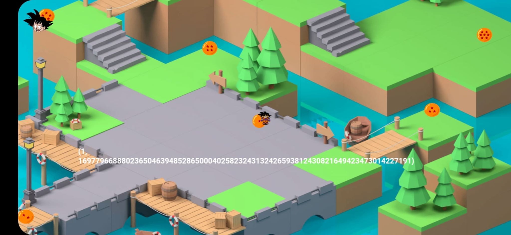
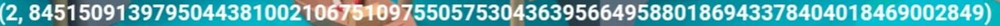

# Shamir's Quest

Description : ... 

## Walkthrough

The first thing we did was installing and playing the game, we found 7 dragon balls, each one gives us 2 numbers.
<p align="center">

</p>

We made a screenshot of every given numbers then we used this [online tool](https://www.iloveimg.com/crop-image) to crop the images.

<p align="center">

</p>

After cropping the images, we run pytesseract to extract the numbers from the cropped images.

```python
from PIL import Image
import pytesseract

for i in range(1,8):
	im = Image.open('cropped/'+str(i)+'.jpg').convert('L')
	print(pytesseract.image_to_string(im, lang='eng', config='--psm 13 --oem 2 -c tessedit_char_whitelist=0123456789,()'))
```

Output
```
169779668388023650463948528650004025823243132426593812430821649423473014227191)
(2,84515091397950443810021067519975505753043639566495880186943378404018469002849)
(3,54008062481679211386368408327065859783198766778147014402616411673289639152699)
(431566639759828849253104354287777292258537248784043419234402145787553977170879)
(5,33814200739788654257795508969553514400370233867365839951719667470054751133890),
(6,648534860607305136155571322784573665580194031012367687584714706161521361565423)
(7,86280222218758143060577039723423036819702949921689517334729056400620503262863)

```
We then went for a quick correction of the numbers manually

```
1-16977966888023650463948528650004025823243132426593812430821649423473014227191
2-84515091397950443810021067510975505753043639566495880186943378404018469002849
3-54008062481679211386368408327065859783198766778147014402616411673289639152699
4-31566639759828849253104354287777292258537243784043419234402145787553977170879
5-33814200739788654257795508969553514400370233867365839951719667470054751133890
6-64853486060730513615551322784573665580194031012367687584714706161521361565423
7-86280222218758143060577039723423036819702949921689517334729056400620503262863
```

Ok we're cool now, googling [Shamir](https://medium.com/@apogiatzis/shamirs-secret-sharing-a-numeric-example-walkthrough-a59b288c34c4) and trying to understand how to works we came across this [Implementation](https://github.com/blockstack/secret-sharing)
So we made a python script using it

```python
from secretsharing import SecretSharer

data = [16977966888023650463948528650004025823243132426593812430821649423473014227191
,84515091397950443810021067510975505753043639566495880186943378404018469002849
,54008062481679211386368408327065859783198766778147014402616411673289639152699
,31566639759828849253104354287777292258537243784043419234402145787553977170879
,33814200739788654257795508969553514400370233867365839951719667470054751133890
,64853486060730513615551322784573665580194031012367687584714706161521361565423
,86280222218758143060577039723423036819702949921689517334729056400620503262863]

fdata=[]
[fdata.append(str(i)+'-'+str(hex(data[i-1])[2:-1])) for i in range(1,8)]

ret = SecretSharer.recover_secret(fdata[0:7])
print(ret.decode("hex"))
```
## Flag

ph0wn{Sh4m1r_4nd_G0ku_P4rtyt1me}

